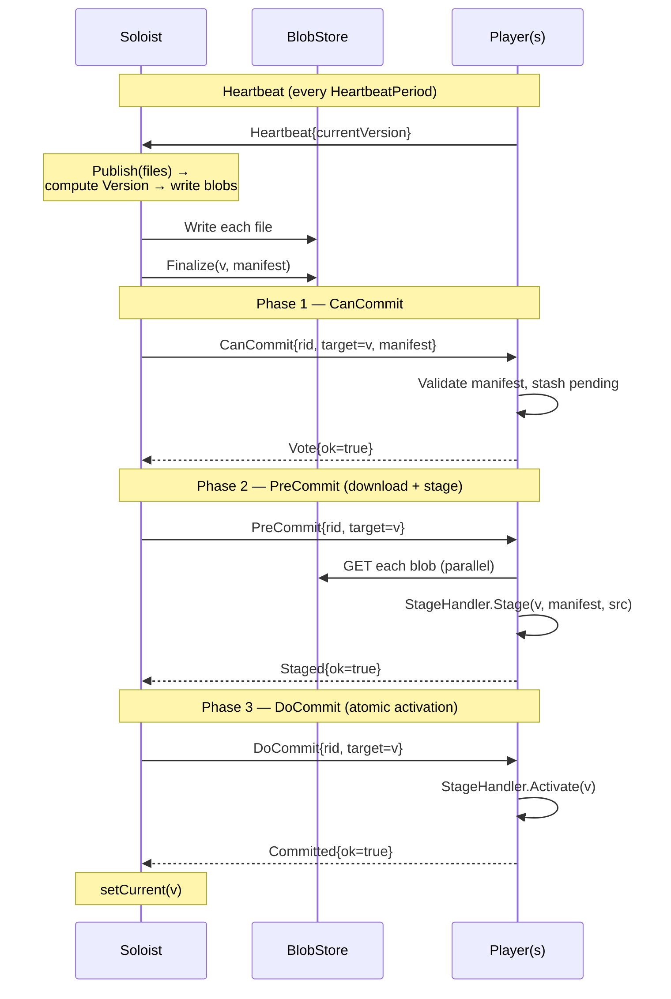

[](https://foomo.github.io/maestro/)
[](https://godoc.org/github.com/foomo/maestro)
[](https://app.codecov.io/gh/foomo/maestro)
[](https://github.com/foomo/maestro)

<p align="center">
  
</p>

# maestro

> Atomic in-memory state replication for Go, over NATS.

Replicate a single in-memory state from one writer to many readers, atomically, over NATS. The state is whatever Go
value your service holds in memory — a catalog, a routing table, a feature flag set. Maestro coordinates a three-phase
commit so every reader either flips to the new version together or keeps the old one; partial updates are not
observable. Bytes flow through a pluggable
`BlobStore` (HTTP, S3, …); only control plane traffic touches NATS.

## Architecture

- **Soloist** (`pkg/maestro/soloist`) — single-replica writer. Owns the
  `BlobStore` (writes). Drives 3PC rounds. Tracks a player roster from heartbeats. State is in-memory only; restart
  loses `currentVersion` and the cluster has no committed version until the next `Publish`.
- **Player** (`pkg/maestro/player`) — N replicas. Heartbeat to soloist. Subscribe to round broadcasts. Invoke a
  user-supplied `StageHandler` on stage / activate / abort. Download manifest files via `BlobReader`.
- **Transport** (`pkg/maestro/transport`) — typed pub/sub bundle over goflux+NATS. Eight `goflux.Topic[T]` fields;
  `NewTransport(*nats.Conn)`
  wires them.
- **BlobStore / BlobReader** (`pkg/maestro/blobstore`) — pluggable. `localfs`
  ships in-box: the soloist serves files over an internal HTTP handler; players fetch via `localfs.NewClient(httpBase)`.

```
            ┌──────────┐  heartbeats (NATS)   ┌─────────┐
            │  Player  │ ───────────────────▶ │ Soloist │
            │  (× N)   │ ◀─────────────────── │  (× 1)  │
            └────┬─────┘     3PC (NATS)       └────┬────┘
                 │                                 │
                 │ HTTP GET /blob/{v}/{name}       │
                 ▼                                 ▼
            ┌──────────────────────────────────────┐
            │   BlobStore  (localfs / s3 / …)      │
            └──────────────────────────────────────┘
```

No leader election. Soloist is `replicas=1`. Restart = brief NATS disconnect; players reconnect and resync if drifted.

## The 3PC protocol



**Abort path.** If any player votes `ok=false` in phase 1, or any `Staged`
reply fails in phase 2, the soloist publishes `Abort{reason}` for the round. Every player that has stashed a pending
artifact for the round calls
`StageHandler.Abort(v)` to discard it. Phase 3 failures (slow / missing
`Committed` replies) are not aborted — the soloist marks the player dirty for the next resync.

**Silent commit.** If the roster is empty at `Publish` time, the soloist skips 3PC and writes `currentVersion` directly.
Late-joining players resync.

**Resync.** Every `RosterScanTick`, the soloist scans heartbeats. Any player whose `currentVersion` differs from
`Current()` is targeted with a fresh 3PC round, debounced by `ResyncDebounce`.

## Implementation guide

### 1. Implement `StageHandler`

The Player calls these three methods. `Stage` builds an in-memory artifact from the manifest's files; `Activate`
promotes it; `Abort` discards it.

```go
type myHandler struct {
cur     atomic.Pointer[Catalog]
pending map[maestro.Version]*Catalog
mu      sync.Mutex
}

func (h *myHandler) Stage(ctx context.Context, v maestro.Version, m maestro.Manifest, src player.FileSource) error {
r, err := src.Open("catalog.json") // hash-verified by the framework
if err != nil {
return err
}
defer r.Close()

var c Catalog
if err := json.NewDecoder(r).Decode(&c); err != nil {
return err
}

h.mu.Lock()
h.pending[v] = &c
h.mu.Unlock()

return nil
}

func (h *myHandler) Activate(ctx context.Context, v maestro.Version) error {
h.mu.Lock()
defer h.mu.Unlock()

p, ok := h.pending[v]
delete(h.pending, v)
if !ok {
return fmt.Errorf("no pending for %q", v)
}

h.cur.Store(p)
return nil
}

func (h *myHandler) Abort(_ context.Context, v maestro.Version) error {
h.mu.Lock()
delete(h.pending, v)
h.mu.Unlock()
return nil
}

func (h *myHandler) Current() *Catalog { return h.cur.Load() }
```

Notes:

- Returning an error from `Stage` votes against the round.
- `FileSource.Open` returns a stream whose bytes are sha256-verified against the manifest as you read. Do not re-hash.
- `Abort` may fire for a version that never staged successfully — treat as a no-op.

### 2. Wire a Player into a foomo/keel server

```go
svr := keel.NewServer(
keel.WithHTTPHealthzService(true),
keel.WithHTTPPrometheusService(true),
)
l := svr.Logger()

nc, err := keelnats.Connect(svr, natsURL)
log.Must(l, err)

h := &myHandler{pending: make(map[maestro.Version]*Catalog)}

pl, err := player.New(player.Options{
Logger:       l,
Transport:    transport.NewTransport(nc),
BlobReader:   localfs.NewClient(soloistHTTPBase),
InstanceID:   instanceID,
StageHandler: h,
})
log.Must(l, err)

svr.AddService(pl) // Start blocks for service lifetime
svr.AddCloser(pl) // Close on SIGTERM

wired := healthz.NewHealthzerFn(func (_ context.Context) error {
if !pl.Wired() {
return errors.New("player not wired")
}
return nil
})
svr.AddReadinessHealthzers(wired)
svr.AddLivenessHealthzers(wired)

svr.AddPublicHTTPService(http.HandlerFunc(func (w http.ResponseWriter, r *http.Request) {
c := h.Current()
if c == nil {
http.Error(w, "no state", http.StatusServiceUnavailable)
return
}
_ = json.NewEncoder(w).Encode(c)
}))

svr.Run()
```

Gate both probes on `Wired()` (subscribers + heartbeat running). Not
`Ready()` — `Ready()` flips only after the first `DoCommit` lands, so a cold cluster (soloist restarted, no `Publish`
yet) leaves the pod permanently NotReady. Surface "no data yet" through the public HTTP handler instead.

### 3. Wire a Soloist into a foomo/keel server

```go
svr := keel.NewServer(
keel.WithInitService(keelnatsservice.MustNewEmbeddedServer()),
keel.WithHTTPHealthzService(true),
)
l := svr.Logger()

nc, err := keelnats.Connect(svr, keelnatsservice.DefaultEmbeddedServerURL)
log.Must(l, err)

bs, err := localfs.NewStore(localfs.Config{DataDir: "/var/lib/maestro/data"})
log.Must(l, err)

svr.AddInternalHTTPService(bs.Handler()) // players GET blobs here

sol, err := soloist.New(soloist.Options{
Logger:     l,
BlobStore:  bs,
Transport:  transport.NewTransport(nc),
InstanceID: instanceID,
})
log.Must(l, err)

svr.AddService(sol)
svr.AddCloser(sol)

ready := healthz.NewHealthzerFn(func (_ context.Context) error {
if !sol.Ready() {
return errors.New("soloist not ready")
}
return nil
})
svr.AddReadinessHealthzers(ready)
svr.AddLivenessHealthzers(ready)

// publish handler: POST → sol.Publish(ctx, []soloist.File{...})

svr.Run()
```

The embedded NATS server lives inside the soloist pod. Players reach it over the cluster network.
`localfs.NewStore(...).Handler()` is the `http.Handler`
that serves blobs to player downloaders.

## Configuration

### `player.Options`

| Field                 | Default | Notes                                             |
|-----------------------|---------|---------------------------------------------------|
| `HeartbeatPeriod`     | `5s`    | Lower = faster roster updates, more NATS traffic. |
| `DownloadConcurrency` | `4`     | Parallel blob fetches inside one `PreCommit`.     |
| `InstanceID`          | —       | Unique per pod. Use hostname.                     |

### `soloist.Options`

| Field              | Default                           | Notes                                                        |
|--------------------|-----------------------------------|--------------------------------------------------------------|
| `HeartbeatWindow`  | `15s`                             | Player is "alive" if a heartbeat arrived within this window. |
| `RosterScanTick`   | `5s`                              | How often the resync loop wakes.                             |
| `ResyncDebounce`   | `10s`                             | Minimum gap between two resync rounds.                       |
| `CanCommitTimeout` | `10s`                             | Phase 1 deadline.                                            |
| `StageTimeout`     | `~2× size / 10 MiB/s`, ≥60s, ≤30m | Phase 2 deadline. Adaptive to manifest total size.           |
| `DoCommitTimeout`  | `10s`                             | Phase 3 deadline. Stragglers are marked dirty, not aborted.  |

All three of Player, Soloist, and Transport accept a `*zap.Logger`, OTel
`metric.MeterProvider`, and `trace.TracerProvider` via their Options.

## Operational notes

- **Heartbeat-before-subscribe race.** A fresh player publishes its first heartbeat before its subscribers finish
  wiring; the first resync round targeting it may miss replies. The soloist's debounced resync (next attempt ≥
  `ResyncDebounce` later) catches it. Nothing to do.
- **Soloist restart loses `currentVersion`.** New players become `Wired()`
  but never `Ready()` until the next `Publish`. If cold-start data is required, have your soloist `Publish` on boot from
  a persistent source.
- **No rollback.** Forward-only. A bad publish is fixed by the next publish.
- **No leader election.** Soloist is a `replicas=1` Deployment with stable DNS. Restart = brief disconnect; players
  reconnect and resync if drifted.

## How to Contribute

Contributions are welcome! Please read the [contributing guide](docs/CONTRIBUTING.md).

See [CONTRIBUTING.md](docs/CONTRIBUTING.md) for details.


## License

Distributed under MIT License, see [LICENSE](LICENSE) for details.

_Made with ♥ [foomo](https://www.foomo.org) by [bestbytes](https://www.bestbytes.com)_
