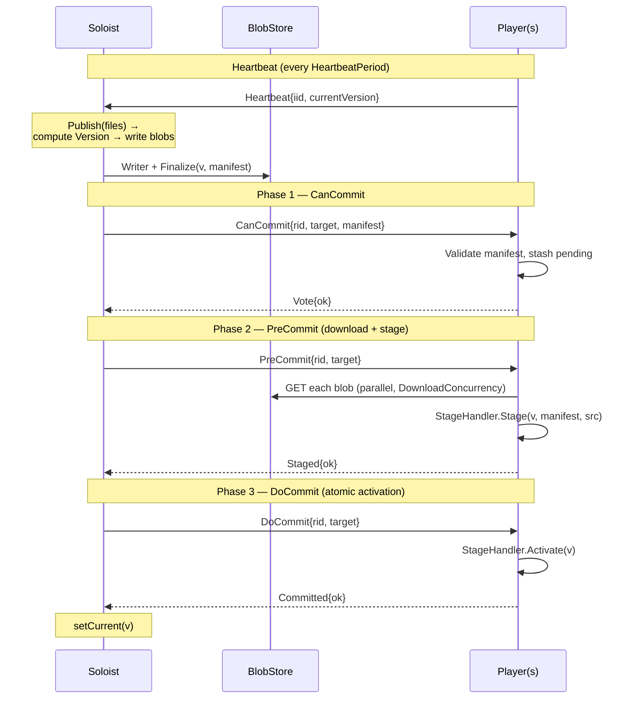

# The 3PC Protocol

This describes what happens on the wire for a `Publish` call, and what
happens when it doesn't go smoothly. Read this if you're deciding timeouts,
debugging a stuck round, or reasoning about failure modes.

## Roles and identity

- **Soloist** — one process, `InstanceID` arbitrary (not part of the
  protocol's identity scheme). Owns `Publish`, drives every round.
- **Player** — N processes, each with a caller-supplied `InstanceID`
  (`soloist.Options.InstanceID` / `player.Options.InstanceID`). This is the
  key the Soloist's [`Roster`](#the-roster) tracks players by across
  restarts — use something stable, like the pod hostname.

## Sequence

`Publish` builds the `Manifest` via `IngestFiles` (writes every file to the
`BlobStore`, computes the content-addressed `Version`, calls `Finalize`)
*before* the round starts — by the time any player sees `CanCommit`, the
bytes are already durably staged in the store and safe to fetch. Read the
`Manifest`/`Version` model in [BlobStore](/guide/blobstore#manifest-and-version).

## Phase timeouts

Each phase runs under its own deadline (`soloist.Options`):

| Phase | Option | Behavior on timeout/failure |
|---|---|---|
| 1 — CanCommit | `CanCommitTimeout` | Round aborts. `Publish` returns error. |
| 2 — PreCommit | `StageTimeout(totalSize)` | Round aborts. `Publish` returns error. |
| 3 — DoCommit | `DoCommitTimeout` | **Not aborted.** Slow/missing repliers are marked dirty for the next resync. `Publish` still returns an error to the caller (do_commit timeout), but players that *did* commit keep the new version. |

`StageTimeout` defaults to a function of manifest size (`~2×` at an assumed
10 MiB/s floor, clamped to `[60s, 30m]`) rather than a fixed duration —
large manifests get proportionally longer to download and stage. Override
it if your `StageHandler.Stage` does expensive decoding beyond the
download itself.

The asymmetry between phase 1/2 and phase 3 is deliberate: phases 1–2 are
reversible (nothing has been activated yet, `Abort` just discards staged
state), but phase 3 is a one-way door — a player that already ran
`Activate` cannot be told to un-activate. Rather than invent a rollback,
the protocol accepts the player is now ahead and lets the roster's
[resync](#resync) mechanism catch up any stragglers instead.

## Abort path

If any player's `Vote.OK` is `false` in phase 1, or any `Staged.OK` is
`false` in phase 2, the Soloist publishes `Abort{rid, reason}` and stops
the round — it never proceeds to the next phase for anyone. Every player
that had stashed a pending manifest or staged artifact for that round
calls `StageHandler.Abort(v)` to discard it. `Abort` is expected to be a
no-op for a version that never actually staged; the callback should treat
"nothing to discard" as success, not an error.

A player is free to reject in phase 1 (e.g. `Manifest.Validate()` fails,
or its `StageHandler` has business reasons to refuse) or in phase 2 (e.g.
download failure, decode error in `Stage`). Either way the *whole cluster*
stays on the prior version — there's no partial rollout to reason about.

## Silent commit

If the Soloist's roster is empty when `Publish` is called (no players have
heartbeated within `HeartbeatWindow`), it skips the 3PC round entirely and
sets `currentVersion` directly. This is the common case for the very first
publish, before any player has started. Players that join later pick up
the version through [resync](#resync), not through a round they missed.

## The roster

The Soloist maintains a `Roster`: a map of `InstanceID → (CurrentVersion,
LastSeen)` built from incoming `Heartbeat` messages, published by every
Player every `HeartbeatPeriod`. `Snapshot()` (used to compute the
`expected` set for a round) only includes players whose last heartbeat is
within `HeartbeatWindow` — a heartbeat-silent player simply falls out of
the expected set rather than blocking future rounds.

## Resync

Every `RosterScanTick`, the Soloist calls `StaleAgainst(currentVersion)` —
any alive player whose last-reported `CurrentVersion` doesn't match gets a
fresh, targeted 3PC round (`expected` = just the stale players), no more
often than once per `ResyncDebounce`. This is what heals:

- **A newly-joined or restarted player.** It shows up in the roster on
  `HeartbeatPeriod`, reports its (possibly empty) `CurrentVersion`, and if
  that doesn't match `Current()`, gets targeted on the next scan tick.
- **A player marked dirty after a phase-3 timeout** (see above) — same
  mechanism, it's just already been flagged.

Resync uses the *same* `runRound` as `Publish` — from a player's
perspective there is no difference between an original round and a resync
round targeting it.

## Idempotency

Both `CanCommit` and `PreCommit`/`DoCommit` handlers short-circuit if the
player's `CurrentVersion()` already equals the round's `Target` — it votes
`OK` immediately without re-validating, re-downloading, or re-activating.
This makes resync cheap to over-trigger and makes duplicate delivery (NATS
at-least-once semantics under reconnects) harmless.

## What's not covered

- **No rollback.** Forward-only — a bad publish is fixed by the next
  `Publish`, not by reverting.
- **No leader election.** The Soloist is assumed `replicas=1`; if the pod
  restarts, `currentVersion` and the roster reset to empty in memory (see
  [Operational notes in the README](https://github.com/foomo/maestro#operational-notes)).
- **No cross-round ordering guarantee beyond "current wins."** If you call
  `Publish` again before a round finishes, the new round targets the
  latest roster snapshot; there is a round mutex (`Soloist.mu`) so rounds
  don't interleave, but nothing queues concurrent `Publish` callers beyond
  blocking on that mutex.
